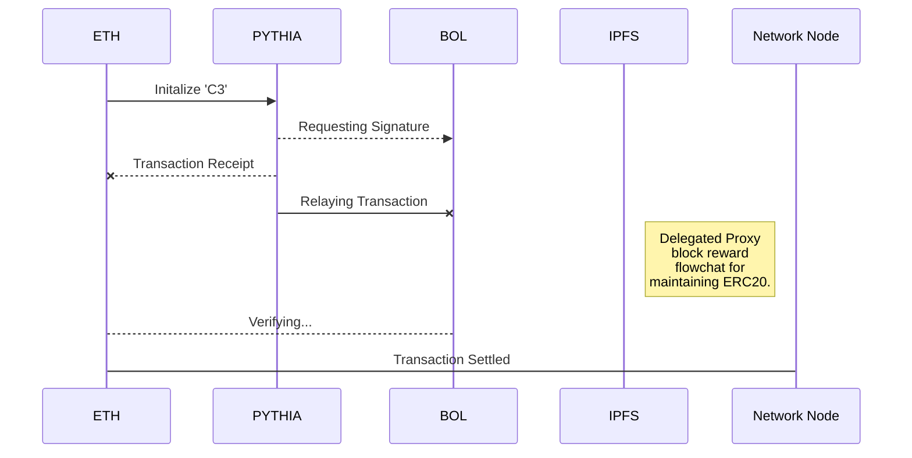

# Terraform Besu Operator Node

1. *Operator*
     1.1. Authority  
     1.2. Validator  
     1.3. Signer     
     1.4. Heartbeat  
 

```mermaid
sequenceDiagram
ETH ->> PYTHIA: Initalize 'C3'
PYTHIA -->>BOL: Requesting Signature
PYTHIA--x ETH: Transaction Receipt
PYTHIA-x BOL: Relaying Transaction
Note right of IPFS: Delegated Proxy <br/>block reward<br/>flowchat for<br/>maintaining ERC20.

BOL-->ETH: Verifying...
ETH->Network Node: Transaction Settled
```

# License 

Apache 2.0 
